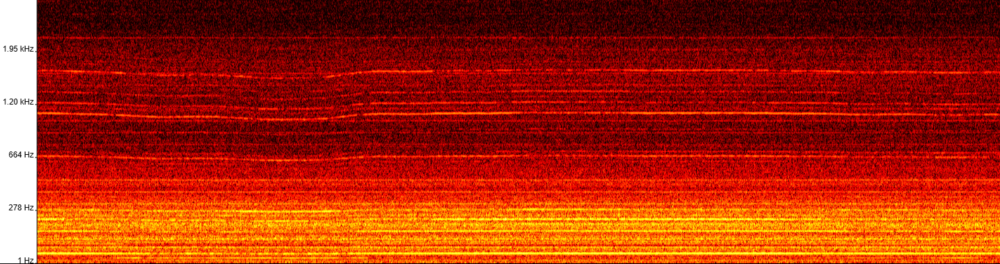

# Spectro


## Introdução

**Spectro** é uma biblioteca escrita em TypeScript que gera espectrogramas a partir de dados de áudio (Float32Array). Ela utiliza a Transformada Rápida de Fourier (FFT) com diferentes funções janela e suporta mapeamento de cores (colormaps) com um conjunto de colormaps inspirados no Matplotlib.



## Recursos

- Geração de espectrogramas a partir de um array de áudio (single channel)
- Configuração flexível de parâmetros:
  - Taxa de amostragem, faixa de frequência (fMin e fMax)
  - Tamanho do FFT e função janela (ex.: Blackman-Harris 7)
  - Seleção de escala (Linear ou Mel)
  - Escolha de colormap
  - Altura final do canvas e quantidade de ticks no eixo de frequência
- Colormaps exportados e tipados (ex.: `hot`, `jet`, etc.)


## Pré-requisitos

Antes de começar, certifique-se de ter as seguintes ferramentas instaladas:

- [Node.js](https://nodejs.org/) (recomendado versão LTS)
- npm (geralmente vem com o Node.js)

## Instalação

Siga as etapas abaixo para configurar o projeto em sua máquina local:

1. Clone o repositório:
    ```bash
    git clone https://github.com/IMNascimento/Spectro.git
    ```
2. Navegue até o diretório do projeto:
    ```bash
    cd Spectro
    ```
3. Instale as dependências:
    ```bash
    npm install
    ```

## Configuração do TypeScript:
O arquivo tsconfig.json já está configurado para gerar módulos ES6 e arquivos de declaração (d.ts):
```json
{
    "compilerOptions": {
        "target": "ES5",
        "module": "ES6",
        "declaration": true,
        "outDir": "./dist",
        "strict": true,
        "esModuleInterop": true,
        "lib": ["dom", "es2015"]
    },
    "include": ["src/**/*"]
}
```

## Compilação
Para compilar o código TypeScript e gerar os arquivos JavaScript na pasta dist, execute:
```bash
    npm run build
```
## Exemplos de Uso

### Em Angular
1. Instale sua lib via npm.
```bash
npm i @sophialabs/spectro
```
2. Importe a classe em um componente Angular:
```ts
// Exemplo: app.component.ts
import { Component } from '@angular/core';
import { SpectrogramGenerator, SpectrogramParams } from 'spectro';

@Component({
  selector: 'app-root',
  template: `
    <input type="file" (change)="onFileChange($event)" accept="audio/*" />
    <div #container></div>
  `
})
export class AppComponent {
  onFileChange(event: Event) {
    const input = event.target as HTMLInputElement;
    if (input.files && input.files.length) {
      const file = input.files[0];
      const reader = new FileReader();
      reader.onload = async (e: any) => {
        const arrayBuffer = e.target.result;
        const audioCtx = new AudioContext();
        const audioBuffer = await audioCtx.decodeAudioData(arrayBuffer);
        const audioData = audioBuffer.getChannelData(0);
        
        // Defina os parâmetros conforme necessário
        const params: SpectrogramParams = {
          scaleType: 'Mel',
          fMin: 1,
          fMax: 20000,
          fftSize: 8192,
          windowType: 'BH7',
          colormapName: 'hot',
          canvasHeight: 400,
          nTicks: 6
        };

        const generator = new SpectrogramGenerator(params);
        const canvas = generator.generateSpectrogram(audioData);
        
        // Adicione o canvas ao DOM (você pode usar ViewChild ou Renderer2)
        document.querySelector('#container')?.appendChild(canvas);
      };
      reader.readAsArrayBuffer(file);
    }
  }
}
```

3. Adicione os assets necessários:
Certifique-se de que os arquivos compilados (por exemplo, os arquivos de sua lib e os colormaps) estejam disponíveis no build final do Angular. Você pode incluí-los via assets ou importar diretamente em seus módulos.

### Em Outros Projetos TypeScript/JavaScript
Basta importar a lib normalmente, seja via npm ou via um caminho relativo. Por exemplo, em um projeto Node.js ou um script ES:
```ts
import { SpectrogramGenerator } from 'spectro';

const params = {
  scaleType: 'Mel',
  fMin: 1,
  fMax: 20000,
  fftSize: 8192,
  windowType: 'BH7',
  colormapName: 'hot',
  canvasHeight: 400,
  nTicks: 6
};

const generator = new SpectrogramGenerator(params);
// Supondo que você tenha audioData (Float32Array)
const canvas = generator.generateSpectrogram(audioData);
// Faça o que desejar com o canvas...
```

### Testando a Biblioteca com um Áudio Local
Para testar a lib em uma página web:

1. Crie um arquivo index.html na raiz do projeto (ou utilize o exemplo fornecido abaixo).

2. Utilize um servidor local para servir os arquivos (por exemplo, com http-server). Se ainda não tiver o http-server instalado globalmente, instale-o via npm:
```bash
npm install -g http-server
```
3. Na raiz do projeto, execute:
```bash
http-server .
```
4. Acesse a URL fornecida (por exemplo, http://127.0.0.1:8080/) no navegador.

## Exemplo de index.html
```html
<!DOCTYPE html>
<html lang="pt">
<head>
  <meta charset="UTF-8">
  <title>Teste da Lib Spectro</title>
  <style>
    body {
      font-family: sans-serif;
      margin: 20px;
    }
    #controls {
      margin-bottom: 20px;
    }
    canvas {
      border: 1px solid #000;
      display: block;
      margin-top: 10px;
      max-width: 100%;
    }
    #spectroContainer {
        max-width: 100%;
        overflow-x: auto; /* Adiciona barra de rolagem horizontal se necessário */
    }

  </style>
</head>
<body>
  <h1>Teste da Lib Spectro</h1>
  <div id="controls">
    <label for="audioFile">Carregar arquivo de áudio:</label>
    <input type="file" id="audioFile" accept="audio/*" />
    <br><br>
    <label for="scale">Escala:</label>
    <select id="scale">
      <option value="Linear">Linear</option>
      <option value="Mel" selected>Mel</option>
    </select>
    <label for="f_min">Frequência Mínima (Hz):</label>
    <select id="f_min">
      <option value="1" selected>1</option>
      <option value="10">10</option>
      <option value="20">20</option>
      <option value="50">50</option>
      <option value="100">100</option>
    </select>
    <label for="f_max">Frequência Máxima (Hz):</label>
    <select id="f_max">
      <option value="1000">1 KHz</option>
      <option value="2000">2 KHz</option>
      <option value="5000">5 KHz</option>
      <option value="10000">10 KHz</option>
      <option value="20000" selected>20 KHz</option>
    </select>
    <br><br>
    <label for="customFmax">Frequência Máxima Personalizada (Hz):</label>
    <input type="number" id="customFmax" min="1" placeholder="Ex: 15000" />
    <small>(Se preenchido, sobrescreve o select acima)</small>
    <br><br>
    <label for="fftSize">Tamanho do Buffer (FFT):</label>
    <select id="fftSize">
      <option value="2048">2048</option>
      <option value="4096">4096</option>
      <option value="8192" selected>8192</option>
    </select>
    <label for="window">Função Janela:</label>
    <select id="window">
      <option value="None">None</option>
      <option value="Cosine">Cosine</option>
      <option value="Hanning">Hanning</option>
      <option value="BH7" selected>Blackman Harris 7</option>
    </select>
    <label for="colormap">Colormap:</label>
    <select id="colormap">
      <option value="hot" selected>hot</option>
      <option value="jet">jet</option>
      <option value="viridis">viridis</option>
      <option value="Greens">Greens</option>
      <option value="turbo">turbo</option>
      <option value="terrain">terrain</option>
      <option value="RdPu">RdPu</option>
      <option value="binary">binary</option>
      <!-- Adicione outros se necessário -->
    </select>
    <br><br>
    <label for="canvasHeight">Altura do espectrograma (px):</label>
    <input type="number" id="canvasHeight" value="400" min="100" step="50" />
    <br><br>
    <button id="generateBtn">Gerar Espectrograma</button>
  </div>

  <div id="spectroContainer"></div>

  <!-- Importa os colormaps e a lib compilada -->
  <script type="module">
    // Importa a classe da sua lib compilada (disponível em dist/)
    import { SpectrogramGenerator } from './dist/index.js';
    import { partial } from './dist/colormaps.js';
    window.partial = partial;

    // Exponha os colormaps globalmente, se necessário:
    window.hot = partial('hot');
    window.jet = partial('jet');
    window.viridis = partial('viridis');
    window.Greens = partial('Greens');
    window.turbo = partial('turbo');
    window.terrain = partial('terrain');
    window.RdPu = partial('RdPu');
    window.binary = partial('binary');

    document.getElementById('generateBtn').addEventListener('click', async () => {
      const fileInput = document.getElementById('audioFile');
      if (!fileInput.files || fileInput.files.length === 0) {
        console.error('Nenhum arquivo selecionado.');
        return;
      }
      const file = fileInput.files[0];
      const arrayBuffer = await file.arrayBuffer();
      const audioCtx = new AudioContext();
      const audioBuffer = await audioCtx.decodeAudioData(arrayBuffer);
      const audioData = audioBuffer.getChannelData(0);

      // Obtenha os parâmetros dos controles (sem type assertions, usando getElementById)
      const scaleElement = document.getElementById('scale');
      const fminElement = document.getElementById('f_min');
      const fmaxElement = document.getElementById('f_max');
      const customFmaxElement = document.getElementById('customFmax');
      const fftSizeElement = document.getElementById('fftSize');
      const windowElement = document.getElementById('window');
      const colormapElement = document.getElementById('colormap');
      const canvasHeightElement = document.getElementById('canvasHeight');

      const params = {
        sampleRate: audioBuffer.sampleRate,
        scaleType: scaleElement ? scaleElement.value : 'Mel',
        fMin: fminElement ? parseFloat(fminElement.value) : 1,
        fMax: (customFmaxElement && customFmaxElement.value.trim() !== '')
          ? parseFloat(customFmaxElement.value)
          : (fmaxElement ? parseFloat(fmaxElement.value) : 20000),
        fftSize: fftSizeElement ? parseInt(fftSizeElement.value) : 8192,
        windowType: windowElement ? windowElement.value : 'BH7',
        colormapName: colormapElement ? colormapElement.value : 'hot',
        canvasHeight: canvasHeightElement ? parseInt(canvasHeightElement.value) : 400,
        nTicks: 6
      };

      // Cria a instância da sua lib e gera o espectrograma
      const generator = new SpectrogramGenerator(params);
      const spectroCanvas = generator.generateSpectrogram(audioData);

      // Exibe o canvas na página
      const container = document.getElementById('spectroContainer');
      container.innerHTML = '';
      container.appendChild(spectroCanvas);
    });
  </script>
</body>
</html>
```

## Contribuindo

Contribuições são bem-vindas! Por favor, siga as diretrizes em CONTRIBUTING.md para fazer um pull request.

## Licença

Distribuído sob a licença MIT. Veja LICENSE para mais informações.

## Autores

Igor Nascimento - Desenvolvedor Principal - [IMNascimento](https://github.com/IMNascimento/)

## Agradecimentos
[Recursos ou bibliotecas que você usou]
[Qualquer outra pessoa ou organização que você queira mencionar]
