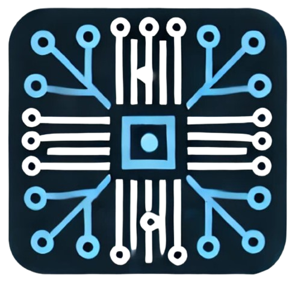
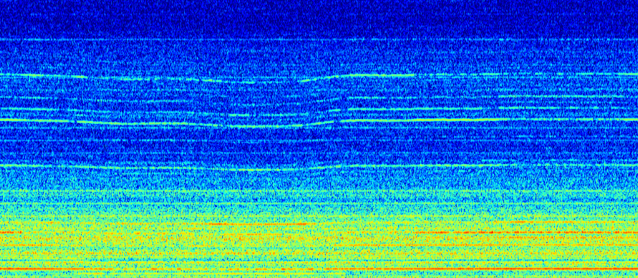

<h1>
   Spectro
</h1>


## Introdução

**Spectro** é uma biblioteca escrita em TypeScript que gera espectrogramas a partir de dados de áudio (Float32Array). Ela utiliza a Transformada Rápida de Fourier (FFT) com diferentes funções janela e suporta mapeamento de cores (colormaps) com um conjunto de colormaps inspirados no Matplotlib.




## Recursos

- Geração de espectrogramas a partir de um array de áudio (single channel)
- Configuração flexível de parâmetros:
  - Taxa de amostragem, faixa de frequência (fMin e fMax)
  - Tamanho do FFT e função janela (ex.: Blackman-Harris 7)
  - Seleção de escala (Linear ou Mel)
  - Escolha de colormap
  - Altura final do canvas e quantidade de ticks no eixo de frequência
  - Geração de **.png** do espectrograma de alta resolução
  - Ocultar o eixo de frequência Hz
  - Passar ganho inicial e faixa de ganho Db.
  - Passagens de filtro **Passa alta**, **Passa Baixo**, **Passa Banda**, **Rejeita banda**
  - Detecção de Frequencia "Pitch Tracking"
  - Extração de Harmônicos
- Colormaps exportados e tipados (ex.: `hot`, `jet`, etc.)


## Pré-requisitos

Antes de começar, certifique-se de ter as seguintes ferramentas instaladas:

- [Node.js](https://nodejs.org/) (recomendado versão LTS)
- npm (geralmente vem com o Node.js)

## Instalação

Siga as etapas abaixo para configurar o projeto em sua máquina local:

1. Clone o repositório:
    ```bash
    git clone https://github.com/IMNascimento/Spectro.git
    ```
2. Navegue até o diretório do projeto:
    ```bash
    cd Spectro
    ```
3. Instale as dependências:
    ```bash
    npm install
    ```

## Configuração do TypeScript:
O arquivo tsconfig.json já está configurado para gerar módulos ES6 e arquivos de declaração (d.ts):
```json
{
    "compilerOptions": {
        "target": "ES5",
        "module": "ES6",
        "declaration": true,
        "outDir": "./dist",
        "strict": true,
        "esModuleInterop": true,
        "lib": ["dom", "es2015"]
    },
    "include": ["src/**/*"]
}
```

## Compilação
Para compilar o código TypeScript e gerar os arquivos JavaScript na pasta dist, execute:
```bash
    npm run build
```
## Exemplos de Uso

### Em Angular
1. Instale sua lib via npm.
```bash
npm i @sophialabs/spectro
```
2. Importe a classe em um componente Angular:
```ts
// app.component.ts
import { Component } from '@angular/core';
import { SpectrogramGenerator, SpectrogramParams, partial } from '@sophialabs/spectro';

@Component({
  selector: 'app-root',
  template: `
    <input type="file" (change)="onFileChange($event)" accept="audio/*" />
    <div id="container"></div>
  `,
  styles: [`
    #container canvas {
      border: 1px solid #000;
      display: block;
      margin: 10px auto;
    }
  `]
})
export class AppComponent {
  onFileChange(event: Event) {
    const input = event.target as HTMLInputElement;
    if (input.files && input.files.length) {
      const file = input.files[0];
      const reader = new FileReader();
      reader.onload = async (e: any) => {
        const arrayBuffer = e.target.result;
        const audioCtx = new AudioContext();
        const audioBuffer = await audioCtx.decodeAudioData(arrayBuffer);
        const audioData = audioBuffer.getChannelData(0);

        // Exponha os colormaps globalmente para que a lib os encontre:
        (window as any).partial = partial;
        (window as any).hot = partial('hot');
        (window as any).jet = partial('jet');
        (window as any).viridis = partial('viridis');
        (window as any).Greens = partial('Greens');
        (window as any).turbo = partial('turbo');
        (window as any).terrain = partial('terrain');
        (window as any).RdPu = partial('RdPu');
        (window as any).binary = partial('binary');

        // Defina os parâmetros completos com valores e comentários explicativos:
        const params: SpectrogramParams = {
          sampleRate: 44100,         // Taxa de amostragem em Hz.
          scaleType: 'Mel',          // Escala de frequência ('Mel' ou 'Linear').
          fMin: 1,                   // Frequência mínima (Hz).
          fMax: 20000,               // Frequência máxima (Hz).
          fftSize: 2048,             // Tamanho do buffer FFT (deve ser potência de 2).
          windowType: 'BH7',         // Função janela: 'None', 'Cosine', 'Hanning' ou 'BH7'.
          colormapName: 'hot',       // Nome do colormap para renderização.
          canvasHeight: 500,         // Altura do canvas final (px).
          nTicks: 20,                // Número de ticks para o eixo de frequência (0 para cálculo automático).
          gainDb: 20,                // Ganho em dB (0 para sem alteração).
          rangeDb: 80,               // Intervalo em dB para normalização (0 para manter escala original).
          targetWidth: 0,            // Largura final desejada (0 utiliza window.innerWidth).
          showFrequencyAxis: false,  // Define se o eixo de frequência será exibido.
          filterType: 'none',        // Tipo de filtro: 'none', 'lowpass', 'highpass', 'bandpass' ou 'notch'.
          filterCutoffs: [],         // Frequências de corte para o filtro (ex: [cutoff] para lowpass).
          enablePitchDetection: true,    // Se true, habilita a detecção de pitch (calcula a frequência fundamental).
          enableHarmonicsExtraction: true  // Se true, habilita a extração de harmônicos (baseada na fundamental).
        };

        // Cria a instância do gerador com os parâmetros definidos:
        const generator = new SpectrogramGenerator(params);

        // Gera o espectrograma e insere o canvas no DOM:
        const canvas = generator.generateSpectrogram(audioData);
        document.querySelector('#container')?.appendChild(canvas);

        // Se a flag de detecção de pitch estiver habilitada, chama o método detectPitch():
        if (params.enablePitchDetection) {
          const fundamentalFreq = generator.detectPitch(audioData);
          console.log('Frequência Fundamental detectada:', fundamentalFreq, 'Hz');
        } else {
          console.log('Detecção de Pitch desabilitada.');
        }

        // Se a flag de extração de harmônicos estiver habilitada, chama o método extractHarmonics():
        if (params.enableHarmonicsExtraction) {
          const { fundamental, harmonics } = generator.extractHarmonics(audioData);
          console.log('Frequência Fundamental:', fundamental, 'Hz');
          console.log('Harmônicos extraídos:', harmonics);
        } else {
          console.log('Extração de Harmônicos desabilitada.');
        }
      };
      reader.readAsArrayBuffer(file);
    }
  }
}
```

3. Adicione os assets necessários:
Certifique-se de que os arquivos compilados (por exemplo, os arquivos de sua lib e os colormaps) estejam disponíveis no build final do Angular. Você pode incluí-los via assets ou importar diretamente em seus módulos.

### Em Outros Projetos TypeScript/JavaScript
Basta importar a lib normalmente, seja via npm ou via um caminho relativo. Por exemplo, em um projeto Node.js ou um script ES:
```ts
import { SpectrogramGenerator, SpectrogramParams, partial } from '@sophialabs/spectro';

// Exponha os colormaps globalmente, se necessário:
window.hot = partial('hot');
window.jet = partial('jet');
window.viridis = partial('viridis');
window.Greens = partial('Greens');
window.turbo = partial('turbo');
window.terrain = partial('terrain');
window.RdPu = partial('RdPu');
window.binary = partial('binary');

// Criação do objeto de parâmetros, com comentários sobre cada um:
const params: SpectrogramParams = {
  sampleRate: 44100,         // Taxa de amostragem em Hz
  scaleType: 'Mel',          // Tipo de escala ('Mel' ou 'Linear')
  fMin: 1,                   // Frequência mínima (Hz)
  fMax: 30000,               // Frequência máxima (Hz)
  fftSize: 2048,             // Tamanho do buffer FFT (deve ser potência de 2)
  windowType: 'BH7',         // Função janela: 'None', 'Cosine', 'Hanning' ou 'BH7'
  colormapName: 'hot',       // Nome do colormap usado para renderizar o espectrograma
  canvasHeight: 500,         // Altura do canvas final em pixels
  nTicks: 30,                // Número de ticks para o eixo de frequência (0 para cálculo automático)
  gainDb: 10,                // Ganho em dB aplicado aos dados (use 0 para manter sem alteração)
  rangeDb: 20,               // Intervalo em dB para normalização dos dados (0 para manter sem alteração)
  targetWidth: 0,            // Largura do canvas final (0 usa window.innerWidth)
  showFrequencyAxis: false,  // Se true, exibe o eixo de frequência no canvas
  filterType: 'none',        // Tipo de filtro: 'none', 'lowpass', 'highpass', 'bandpass' ou 'notch'
  filterCutoffs: [],         // Frequências de corte para o filtro (ex: [cutoff] para lowpass)
  enablePitchDetection: true,      // Habilita a detecção de pitch (retorna a frequência fundamental)
  enableHarmonicsExtraction: true    // Habilita a extração de harmônicos (calculados com base na fundamental)
};

// Suponha que audioData seja um Float32Array contendo os dados de áudio:
declare const audioData: Float32Array;

// Instancia a classe do gerador com os parâmetros definidos:
const generator = new SpectrogramGenerator(params);

// Gera o espectrograma e obtém o canvas resultante:
const canvas = generator.generateSpectrogram(audioData);
// Exemplo de uso: adicionar o canvas ao DOM:
document.body.appendChild(canvas);

// Se a detecção de pitch estiver habilitada, calcula a frequência fundamental:
if (params.enablePitchDetection) {
  const fundamentalFreq = generator.detectPitch(audioData);
  console.log('Frequência Fundamental detectada:', fundamentalFreq, 'Hz');
}

// Se a extração de harmônicos estiver habilitada, extrai os harmônicos:
if (params.enableHarmonicsExtraction) {
  const { fundamental, harmonics } = generator.extractHarmonics(audioData);
  console.log('Frequência Fundamental:', fundamental, 'Hz');
  console.log('Harmônicos extraídos:', harmonics);
}

// Opcional: Exporta uma imagem PNG de alta resolução do espectrograma (fator de ampliação = 3)
const pngDataUrl = generator.exportHighResPNG(audioData, 3);
console.log('PNG de alta resolução:', pngDataUrl);
```

### Testando a Biblioteca com um Áudio Local
Para testar a lib em uma página web:

1. Crie um arquivo index.html na raiz do projeto (ou utilize o exemplo fornecido abaixo).

2. Utilize um servidor local para servir os arquivos (por exemplo, com http-server). Se ainda não tiver o http-server instalado globalmente, instale-o via npm:
```bash
npm install -g http-server
```
3. Na raiz do projeto, execute:
```bash
http-server .
```
4. Acesse a URL fornecida (por exemplo, http://127.0.0.1:8080/) no navegador.

## Exemplo de index.html
```html
<!DOCTYPE html>
<html lang="pt">
<head>
  <meta charset="UTF-8">
  <title>Teste da Lib Spectro - Parâmetros Completos</title>
  <style>
    body {
      font-family: sans-serif;
      margin: 20px;
    }
    #controls {
      margin-bottom: 20px;
    }
    canvas {
      border: 1px solid #000;
      display: block;
      margin-top: 10px;
      max-width: 100%;
    }
    #spectroContainer {
      max-width: 100%;
      overflow-x: auto;
    }
    .param-group {
      margin-bottom: 10px;
    }
    label {
      display: block;
      margin-top: 5px;
    }
  </style>
</head>
<body>
  <h1>Teste da Lib Spectro - Parâmetros Completos</h1>
  <div id="controls">
    <!-- Seleção do arquivo de áudio -->
    <div class="param-group">
      <label for="audioFile">Carregar arquivo de áudio:</label>
      <input type="file" id="audioFile" accept="audio/*">
    </div>

    <!-- Parâmetros básicos para o espectrograma -->
    <div class="param-group">
      <label for="scale">Escala (Linear ou Mel):</label>
      <select id="scale">
        <option value="Linear">Linear</option>
        <option value="Mel" selected>Mel</option>
      </select>
    </div>
    <div class="param-group">
      <label for="f_min">Frequência Mínima (Hz):</label>
      <select id="f_min">
        <option value="1" selected>1</option>
        <option value="10">10</option>
        <option value="20">20</option>
        <option value="50">50</option>
        <option value="100">100</option>
      </select>
    </div>
    <div class="param-group">
      <label for="f_max">Frequência Máxima (Hz):</label>
      <select id="f_max">
        <option value="1000">1 KHz</option>
        <option value="2000">2 KHz</option>
        <option value="5000">5 KHz</option>
        <option value="10000">10 KHz</option>
        <option value="20000" selected>20 KHz</option>
      </select>
    </div>
    <div class="param-group">
      <label for="customFmax">Frequência Máxima Personalizada (Hz):</label>
      <input type="number" id="customFmax" min="1" placeholder="Ex: 15000">
      <small>(Se preenchido, sobrescreve o select acima)</small>
    </div>
    <div class="param-group">
      <label for="fftSize">Tamanho do Buffer (FFT):</label>
      <select id="fftSize">
        <option value="2048" selected>2048</option>
        <option value="4096">4096</option>
        <option value="8192">8192</option>
      </select>
    </div>
    <div class="param-group">
      <label for="window">Função Janela:</label>
      <select id="window">
        <option value="None">None</option>
        <option value="Cosine">Cosine</option>
        <option value="Hanning">Hanning</option>
        <option value="BH7" selected>Blackman Harris 7</option>
      </select>
    </div>
    <div class="param-group">
      <label for="colormap">Colormap:</label>
      <select id="colormap">
        <option value="hot" selected>hot</option>
        <option value="jet">jet</option>
        <option value="viridis">viridis</option>
        <option value="Greens">Greens</option>
        <option value="turbo">turbo</option>
        <option value="terrain">terrain</option>
        <option value="RdPu">RdPu</option>
        <option value="binary">binary</option>
      </select>
    </div>
    <div class="param-group">
      <label for="canvasHeight">Altura do Espectrograma (px):</label>
      <input type="number" id="canvasHeight" value="400" min="100" step="50">
    </div>
    <div class="param-group">
      <label for="targetWidth">Largura Final Desejada (px):</label>
      <input type="number" id="targetWidth" value="0" min="0">
      <small>(0 utiliza window.innerWidth)</small>
    </div>
    <div class="param-group">
      <label for="nTicks">Quantidade de Ticks no eixo (0 para cálculo automático):</label>
      <input type="number" id="nTicks" value="0" min="0">
    </div>
    <div class="param-group">
      <label for="showFrequencyAxis">
        <input type="checkbox" id="showFrequencyAxis"> Exibir Eixo de Frequência
      </label>
    </div>

    <!-- Parâmetros de ganho e normalização -->
    <div class="param-group">
      <label for="gainDb">Ganho (gainDb):</label>
      <input type="number" id="gainDb" value="0" step="0.1">
      <small>(Valor em dB. Use positivo para aumentar, negativo para reduzir)</small>
    </div>
    <div class="param-group">
      <label for="rangeDb">Intervalo (rangeDb):</label>
      <input type="number" id="rangeDb" value="0" step="0.1">
      <small>(Intervalo em dB para normalização; 0 mantém a escala original)</small>
    </div>

    <!-- Parâmetros de filtragem -->
    <div class="param-group">
      <label for="filterType">Tipo de Filtro:</label>
      <select id="filterType">
        <option value="none" selected>none</option>
        <option value="lowpass">lowpass</option>
        <option value="highpass">highpass</option>
        <option value="bandpass">bandpass</option>
        <option value="notch">notch</option>
      </select>
    </div>
    <div class="param-group">
      <label for="filterCutoffs">Frequências de Corte do Filtro:</label>
      <input type="text" id="filterCutoffs" placeholder="Ex: 300,3000">
      <small>(Valores separados por vírgula. Para lowpass/highpass, informe um valor)</small>
    </div>

    <!-- Parâmetros para funcionalidades extras -->
    <div class="param-group">
      <label for="enablePitchDetection">
        <input type="checkbox" id="enablePitchDetection"> Habilitar Detecção de Pitch
      </label>
      <small>(Se ativado, a frequência fundamental será calculada via autocorrelação)</small>
    </div>
    <div class="param-group">
      <label for="enableHarmonicsExtraction">
        <input type="checkbox" id="enableHarmonicsExtraction"> Habilitar Extração de Harmônicos
      </label>
      <small>(Se ativado, os harmônicos serão extraídos com base na frequência fundamental)</small>
    </div>

    <button id="generateBtn">Gerar Espectrograma</button>
  </div>

  <div id="spectroContainer"></div>
  <div id="results"></div>

  <!-- Importa a lib compilada (index.js já reexporta os colormaps) -->
  <script type="module">
    import { SpectrogramGenerator, partial } from './dist/index.es.js'; // ou index.cjs.js

    // Expor as funções colormap globalmente para que a lib as encontre
    window.partial = partial;
    window.hot = partial('hot');
    window.jet = partial('jet');
    window.viridis = partial('viridis');
    window.Greens = partial('Greens');
    window.turbo = partial('turbo');
    window.terrain = partial('terrain');
    window.RdPu = partial('RdPu');
    window.binary = partial('binary');

    document.getElementById('generateBtn').addEventListener('click', async () => {
      const fileInput = document.getElementById('audioFile');
      if (!fileInput.files || fileInput.files.length === 0) {
        console.error('Nenhum arquivo selecionado.');
        return;
      }
      const file = fileInput.files[0];
      const arrayBuffer = await file.arrayBuffer();
      const audioCtx = new AudioContext();
      const audioBuffer = await audioCtx.decodeAudioData(arrayBuffer);
      const audioData = audioBuffer.getChannelData(0);

      // Captura dos parâmetros do formulário
      const scale = document.getElementById('scale').value;
      const fMin = parseFloat(document.getElementById('f_min').value);
      const fMaxSelect = parseFloat(document.getElementById('f_max').value);
      const customFmax = document.getElementById('customFmax').value.trim();
      const fMax = customFmax !== '' ? parseFloat(customFmax) : fMaxSelect;
      const fftSize = parseInt(document.getElementById('fftSize').value);
      const windowType = document.getElementById('window').value;
      const colormapName = document.getElementById('colormap').value;
      const canvasHeight = parseInt(document.getElementById('canvasHeight').value);
      const targetWidth = parseInt(document.getElementById('targetWidth').value);
      const nTicks = parseInt(document.getElementById('nTicks').value);
      const showFrequencyAxis = document.getElementById('showFrequencyAxis').checked;
      const gainDb = parseFloat(document.getElementById('gainDb').value);
      const rangeDb = parseFloat(document.getElementById('rangeDb').value);
      const filterType = document.getElementById('filterType').value;
      const filterCutoffsInput = document.getElementById('filterCutoffs').value;
      // Converte valores de corte para um array de números (se houver)
      const filterCutoffs = filterCutoffsInput.trim() === ''
        ? []
        : filterCutoffsInput.split(',').map(val => parseFloat(val.trim()));
      const enablePitchDetection = document.getElementById('enablePitchDetection').checked;
      const enableHarmonicsExtraction = document.getElementById('enableHarmonicsExtraction').checked;

      // Cria o objeto de parâmetros, com valores padrão zerados/falsos
      const params = {
        sampleRate: audioBuffer.sampleRate,
        scaleType: scale,
        fMin: fMin,
        fMax: fMax,
        fftSize: fftSize,
        windowType: windowType,
        colormapName: colormapName,
        canvasHeight: canvasHeight,
        nTicks: nTicks,
        gainDb: gainDb,
        rangeDb: rangeDb,
        targetWidth: targetWidth,
        showFrequencyAxis: showFrequencyAxis,
        filterType: filterType,
        filterCutoffs: filterCutoffs,
        enablePitchDetection: enablePitchDetection,
        enableHarmonicsExtraction: enableHarmonicsExtraction,
      };

      // Cria a instância do gerador e gera o espectrograma
      const generator = new SpectrogramGenerator(params);
      const spectroCanvas = generator.generateSpectrogram(audioData);
      const container = document.getElementById('spectroContainer');
      container.innerHTML = '';
      container.appendChild(spectroCanvas);

      // Exporta imagem em alta resolução e cria link para download
      const pngDataUrl = generator.exportHighResPNG(audioData, 3);
      console.log('PNG gerado:', pngDataUrl);
      const link = document.createElement('a');
      link.href = pngDataUrl;
      link.download = 'spectrogram.png';
      link.textContent = 'Baixar PNG de alta resolução';
      document.body.appendChild(link);

      // Se a detecção de pitch estiver habilitada, chama o método detectPitch
      const resultsDiv = document.getElementById('results');
      resultsDiv.innerHTML = '';
      if (enablePitchDetection) {
        const fundamentalFreq = generator.detectPitch(audioData);
        const p1 = document.createElement('p');
        p1.textContent = `Frequência Fundamental detectada: ${fundamentalFreq.toFixed(2)} Hz`;
        resultsDiv.appendChild(p1);
      } else {
        const p1 = document.createElement('p');
        p1.textContent = 'Detecção de Pitch desabilitada.';
        resultsDiv.appendChild(p1);
      }

      // Se a extração de harmônicos estiver habilitada, chama o método extractHarmonics
      if (enableHarmonicsExtraction) {
        const { fundamental, harmonics } = generator.extractHarmonics(audioData);
        const p2 = document.createElement('p');
        p2.textContent = `Fundamental: ${fundamental.toFixed(2)} Hz, Harmônicos: [${harmonics.map(h => h.toFixed(2)).join(', ')}]`;
        resultsDiv.appendChild(p2);
      } else {
        const p2 = document.createElement('p');
        p2.textContent = 'Extração de Harmônicos desabilitada.';
        resultsDiv.appendChild(p2);
      }
    });
  </script>
</body>
</html>
```

## Contribuindo

Contribuições são bem-vindas! Por favor, siga as diretrizes em CONTRIBUTING.md para fazer um pull request.

## Licença

Distribuído sob a licença MIT. Veja LICENSE para mais informações.

## Autores

Igor Nascimento - Desenvolvedor Principal - [IMNascimento](https://github.com/IMNascimento/)

## Agradecimentos
Gostaríamos de expressar nossa sincera gratidão à empresa [SophiaLabs](https://github.com/SophiaLab) pelo apoio inestimável no desenvolvimento de códigos open source. Sua dedicação incansável em fortalecer nossa comunidade e impulsionar o universo open source é uma fonte de constante inspiração.

Agradecemos, também, a Deus, cuja graça e orientação têm sido fundamentais em cada passo desta jornada, possibilitando conquistas e o contínuo aprimoramento de nossos projetos.

Muito obrigado a todos que, de alguma forma, colaboram para tornar esse trabalho possível.

